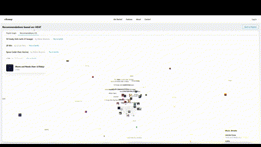

# Spotify VibeMap

A full-stack web application designed to visualize your music taste, and discover new songs as nodes on your personal graph. Built by members of the Aggie Coding Club. This is a work in progress!



## Features

- Graph based visualization of your Spotify listening habits
- Machine learning-based vectorization of songs & playlists
- Similarity scoring between playlists
- Secure login via Spotify's OAuth 2.0

## Tech Stack

- **Frontend:** React, Vite, MantineUI, react-force-graph, D3, Axios
- **Backend:** Flask, Spotify API, node2vec, scikit-learn, NetworkX

## Setup

### 1. Clone the repository
```
git clone https://github.com/brandonyuan/spotify-vibemap.git
cd spotify-vibemap
```

---

### 2. Setup .env variables
```
SPOTIFY_CLIENT_ID=your_client_id
SPOTIFY_CLIENT_SECRET=your_client_secret
REDIRECT_URI=http://localhost:5000/callback
FLASK_SECRET_KEY=your_secret_key
```

### 3. Start the backend

```
cd backend
python3 -m venv venv
source venv/bin/activate  # On Windows: venv\Scripts\activate
pip install -r requirements.txt
flask run
```

The backend will run at `http://localhost:5000`.

---

### 4. Start the frontend

```
cd ../frontend
npm install
npm run dev
```

The frontend will run at `http://localhost:5173`.